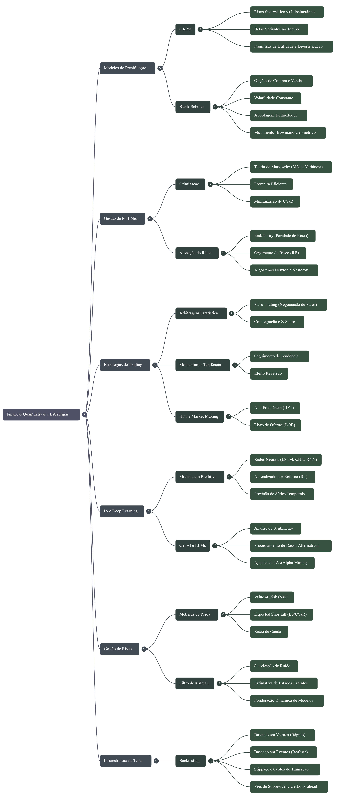

# 📊 AI-Assisted Analysis of Quantitative Strategies

> **Project Type:** Knowledge Engineering & Financial Analysis  
> **Tools:** Google NotebookLM, Gemini 1.5 Pro

## 🧐 Overview

This project leverages **Google's NotebookLM** to synthesize, analyze, and generate insights on complex quantitative finance strategies. By curating high-level financial literature and technical documentation, I created a specialized knowledge base to explore the mathematical foundations of algorithmic trading.

The primary goal was to test the capabilities of Large Language Models (LLMs) in interpreting financial formulas, risk metrics, and market hypotheses based on **curated source materials**, evaluating their **pedagogical ability** to explain complex concepts.

## 🛠️ Tech Stack

* **Google NotebookLM:** RAG (Retrieval-Augmented Generation) engine for source synthesis.
* **Markdown/LaTeX:** For documentation (Created with gemini 1.5).

## 📂 Project Assets

Since NotebookLM workspaces are private, the generated insights have been exported below:

* 📄 ****
* 🔗 *[Notebook Link](https://notebooklm.google.com/notebook/8f4cf078-b968-4977-8d6d-7513cf630109)*

---
